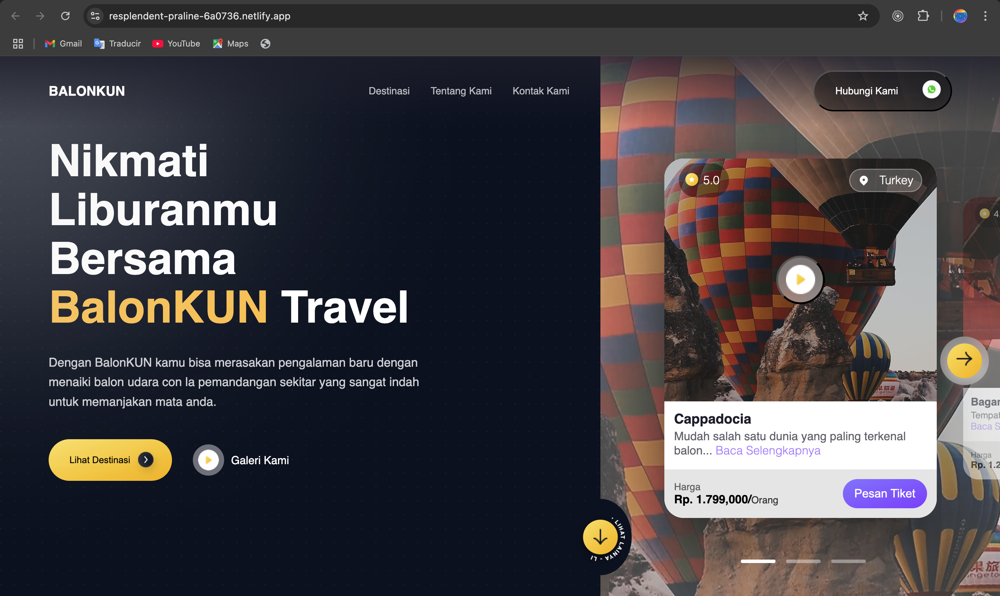

##  Video Slider

> This is a custom component, is a slider of background videos and the videos can be played and pause from the slider.



## Built With

- CSS
- React

## Live Demo

[Live Demo](https://famous-muffin-4da8b4.netlify.app/)


## Getting Started

To get a local copy up and running follow these simple example steps.

- Go to the main page of te repo.
- Press the ```Code``` button and get the repo link.
- Clone it using git.

## Authors

**Cecilia Benitez**

- [@Ceci007](https://github.com/Ceci007)


## Contributing

Contributions, issues and feature requests are welcome!

Feel free to check the [issues page](https://github.com/Ceci007/video-slider/issues).

## License

This project is [MIT](lic.url) licensed.
